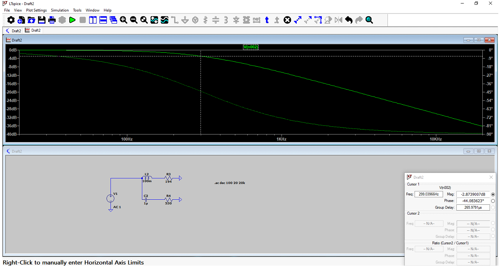
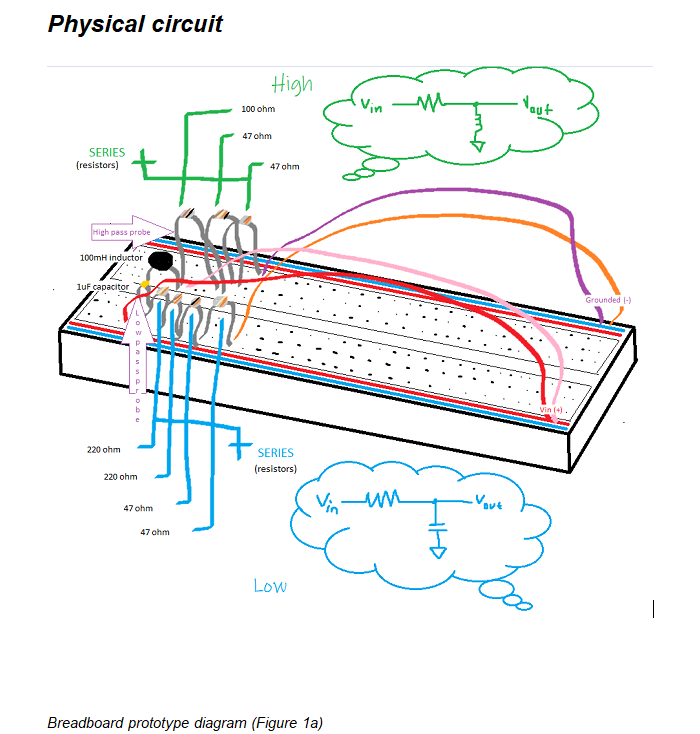

# ECE Circuit labs

Electrical engineering laboratory projects focused on identifying and characterizing filter circuits through simulation and physical measurements.

# Overview

Examined circuit impedance and frequency response across a range of frequencies to identify different types of filter circuits.

The analysis was performed using both LTspice simulation and physical hardware measurements.

Comparing simulated and measured behavior provided a practical look at how real circuits behave compared with theoretical models.

# Methods

## Simulation

#

#

LTspice was used to analyze circuit behavior across different frequencies and examine the resulting response.

## Hardware Analysis

Physical circuit measurements were collected across a range of frequencies and compared against the simulated results.

#

#

# Concepts Demonstrated

- Frequency response
- Impedance
- Filter circuits
- Circuit analysis
- LTspice simulation
- Experimental measurement
- Simulation vs. hardware comparison

# Tools
- LTspice
- Electronic test equipment
- Circuit components
- Data analysis

# Results

The measured impedance and frequency-dependent behavior were used to identify the characteristics of the filter circuits.

The project also provided an opportunity to evaluate differences between ideal simulation results and real hardware measurements.
